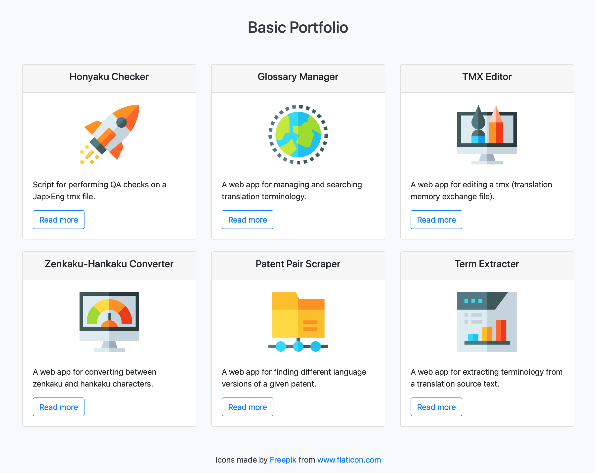

# django_portfolio

### Overview

A simple web app for displaying a portfolio of projects, specifically a list view of all projects and then a detailed view of an individual project. 

Based on a [Django tutorial](https://realpython.com/courses/django-portfolio-project/) from the Real Python team. 

[Live demo](https://jjl-portfolio.herokuapp.com) (deployed on Heroku).

### Built using:

* Python 3.7
* Django 3.0.9
* gunicorn==20.0.4
* whitenoise==5.1.0
* Bootstrap 4
* Visual Studio Code 1.47.3
* macOS 10.14.6
* Heroku

### Screenshot:

